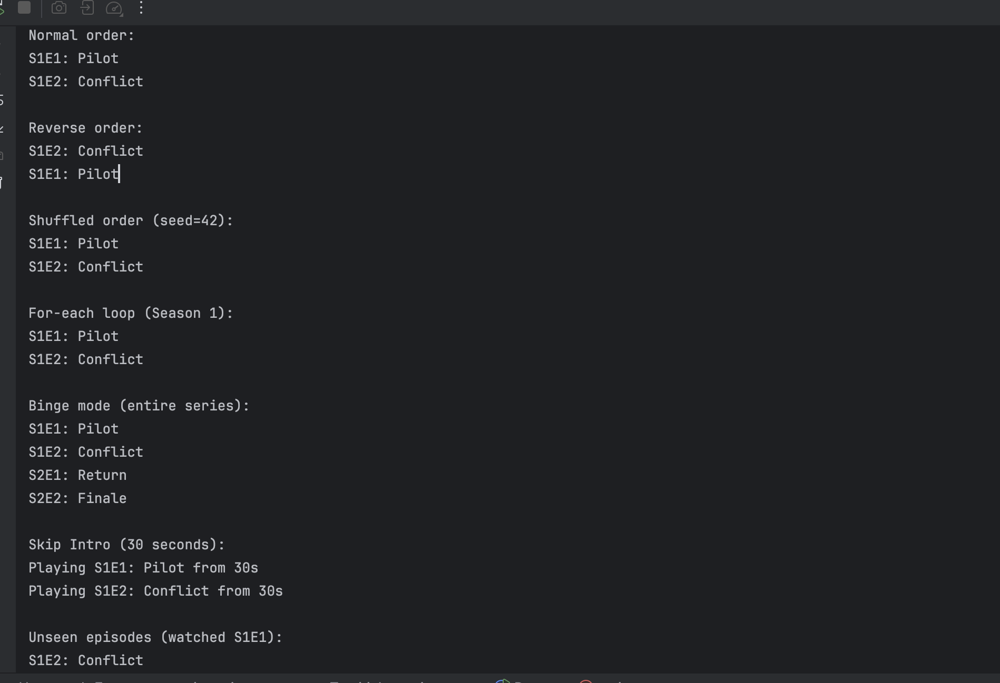

# Streaming-Service Binge Mode and Airport Tower Simulator
This project implements two distinct design patterns: the Iterator Pattern for a streaming service's episode player and the Mediator Pattern for an airport tower simulation. Below is an overview of each part, including the rationale for design choices and key implementation details.

## Part 1 – Iterator Pattern: Streaming Service Binge Mode

### Overview
The Iterator Pattern is used to provide a uniform way to traverse episodes in a TV series, regardless of how seasons store their episodes (e.g., ArrayList, LinkedList, or lazy file loader). This decouples the UI from the internal storage, enabling flexible traversal modes (normal, reverse, shuffle) and a seamless binge-watching experience across seasons.

### Why Iterator Pattern?
Using the Iterator Pattern is preferable to exposing a raw `List<Episode>` for several reasons:
- **Encapsulation**: The Iterator hides the internal storage details, preventing the UI from directly manipulating or depending on the collection type.
- **Flexibility**: It supports multiple traversal orders (normal, reverse, shuffle) without requiring the UI to implement traversal logic.
- **Extensibility**: New iterator types (e.g., "Skip Intro" or watch-history filters) can be added without modifying the core `Season` or `Series` classes.
- **Consistency**: The `BingeIterator` chains seasons into a single iterator, providing a unified interface for the entire series.
- **Standardization**: Implementing `Iterable<Episode>` allows idiomatic Java for-each loops (`for (Episode e : season)`), improving code readability.

**Trade-off**: The Iterator Pattern adds some complexity compared to directly exposing a list, as it requires implementing iterator classes and managing their state. However, the benefits of encapsulation and flexibility outweigh this overhead for a production system.

### Implementation Details
- **EpisodeIterator Interface**: Defines `hasNext()` and `next()` for uniform traversal.
- **Concrete Iterators**:
  - `SeasonIterator`: Traverses episodes in normal order.
  - `ReverseSeasonIterator`: Traverses episodes in reverse order.
  - `ShuffleSeasonIterator`: Randomizes episode order with a fixed seed for repeatable results.
- **Iterable Support**: The `Season` class implements `Iterable<Episode>`, returning a `SeasonIterator` for for-each compatibility.
- **BingeIterator**: Chains seasons together, iterating from Season 1, Episode 1 to the series finale.
- **Optional Features**
  - "Skip Intro" iterator wrapper skips the first n seconds of each episode.
  - Watch-history filter iterator skips previously seen episodes.

### Key Features
- **EpisodeIterator Interface**: Defines `hasNext()` and `next()` for traversal.
- **SeasonIterator / ReverseSeasonIterator / ShuffleSeasonIterator**: Concrete iterators for different traversal modes.
- **Season implements Iterable<Episode>**: Allows `for (Episode ep : season)` syntax.
- **BingeIterator**: Enables continuous viewing across multiple seasons.
- **SkipIntroIterator**: Wraps another iterator and offsets playback start.
- **WatchHistoryIterator**: Wraps another iterator and skips seen episodes.
- **Performance Benchmark**: Iterates through 10,000 fake episodes and reports execution time.

### Benefits of Iterator Pattern
- **Encapsulation**: Hides internal data structures.
- **Flexibility**: Easy to add new traversal strategies.
- **Composition**: Iterators can be layered (e.g., `Binge + SkipIntro + WatchHistory`).
- **Uniform Interface**: Clients use `hasNext()`/`next()` regardless of structure.

### UML


### Result on console:

---



---

### Performance Test result:


---

## Part 2 – Mediator Pattern: Airport Tower Simulator

### Overview
The Mediator Pattern is used to manage communication and coordination between aircraft (passenger planes, cargo planes, helicopters) and a control tower. The `ControlTower` acts as a central hub, preventing chaotic direct communication between aircraft and enforcing runway allocation rules, including emergency protocols.

### Why Mediator Pattern?
The Mediator Pattern is better than direct aircraft-to-aircraft communication for the following reasons:
- **Decoupling**: Aircraft only interact with the `ControlTower`, reducing dependencies and preventing complex many-to-many communication.
- **Centralized Logic**: The tower handles runway scheduling, queue management, and emergency protocols, ensuring consistent and predictable behavior.
- **Scalability**: New aircraft types can be added without modifying existing aircraft or the tower's core logic.
- **Clarity**: The tower's broadcasts and decisions provide a single source of truth, simplifying debugging and coordination.

**Disadvantage**: The Mediator Pattern centralizes logic in the `ControlTower`, which can become a bottleneck or a single point of failure if not designed carefully. Additionally, the tower's implementation may grow complex as new rules or aircraft types are added.

### Key Features
- **TowerMediator Interface**: Central hub that handles `broadcast()` and `requestRunway()`.
- **ControlTower**: Concrete mediator that manages landing and takeoff queues and grants runway access.
- **Aircraft Hierarchy**: Abstract `Aircraft` class and concrete `PassengerPlane`, `CargoPlane`, `Helicopter`.
- **Emergency Handling**: `MAYDAY` calls get prioritized in queues and broadcast warnings.
- **JavaFX Dashboard**: Live GUI shows runway status, queues, and event log.
- **Simulation Driver**: Spawns 10 aircraft, randomly generates runway requests and emergencies.

### UML


### Result


### Reflection
The Mediator pattern greatly simplifies many-to-many communication. Without it, aircraft would need direct references to each other, leading to high coupling and complexity. With Mediator, aircraft only communicate through the tower.

**Disadvantage**: The Mediator becomes a central dependency — it can grow complex and become a bottleneck if not managed properly.

---

## How to Run
### Requirements
- Java 21 or 22
- JavaFX SDK 21+ (We use JavaFX 24)
  
### Run Steps
. **Part 1**:
   - Compile and run the `Main` class to see episode traversal demos.

  **Part 2**:
  1. Set up JavaFX in IntelliJ (`Run > Edit Configurations` → add VM options):
   ```
   --module-path /path/to/javafx-sdk-24/lib --add-modules javafx.controls,javafx.fxml
   ```
  2. Run `TowerDashboard.java` first.
  3. Then run `SimulationDriver.java` to start aircraft simulation.
